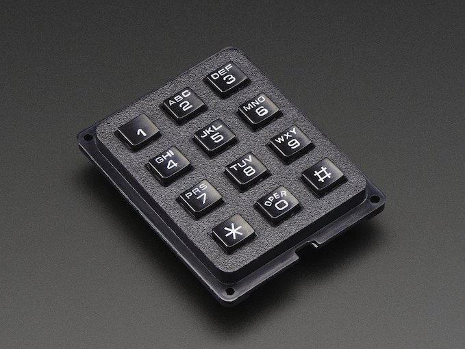
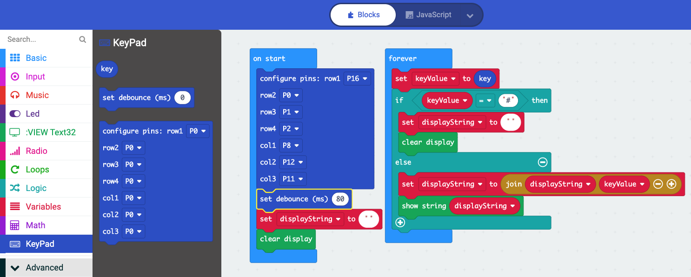

# Makecode PXT keypad extension for BBC micro:bit

Supports 3x4 keypads such as the [Adafruit 3x4 Phone-style Matrix Keypad](https://www.adafruit.com/product/1824).



Adapted from original pxt-keypad by Liou Zheng-Ji https://github.com/lioujj/pxt-keypad

## Setup

Use the "configure pins" block to set up rows and columns (see examples here: https://learn.adafruit.com/matrix-keypad/pinouts).

Use the "set debounce" block to set the key debounce timeout.

## Example

Below is a fairly simple program that uses the Kitronik :VIEW Text32 LCD screen:

* Reads in the key from the keypad and assigns it to a variable
* Appends the key to the end of the string to display
* Displays the string on the LCD
* Clears the display string when the "#" key is pressed

The debounce block is optional as it defaults to 100ms internally. However you may tweak this to your liking.

### Blocks:



### Typescript/Javascript:

```ts
let keyValue = ""
let displayString = ""

keypad.configurePins(
  DigitalPin.P16,
  DigitalPin.P0,
  DigitalPin.P1,
  DigitalPin.P2,
  DigitalPin.P8,
  DigitalPin.P12,
  DigitalPin.P11
  )
keypad.setDebounceMs(80)

Kitronik_VIEWTEXT32.clearDisplay()

// Run main loop
basic.forever(function () {
    // Grab the key press from the keypad.
    keyValue = keypad.getKeyString()

    if (keyValue == "#") {
        // Clear display if we press "#".
        displayString = ""
        Kitronik_VIEWTEXT32.clearDisplay()
    } else {
        // Otherwise, append the key to the display string, and output it to the LCD.
        displayString = "" + displayString + keyValue
        Kitronik_VIEWTEXT32.showString(displayString)
    }
})

```

## License

* MIT

## Supported targets

* for PXT/microbit
(The metadata above is needed for package search.)

```package
keypad=github:fox015/pxt-keypad
```
